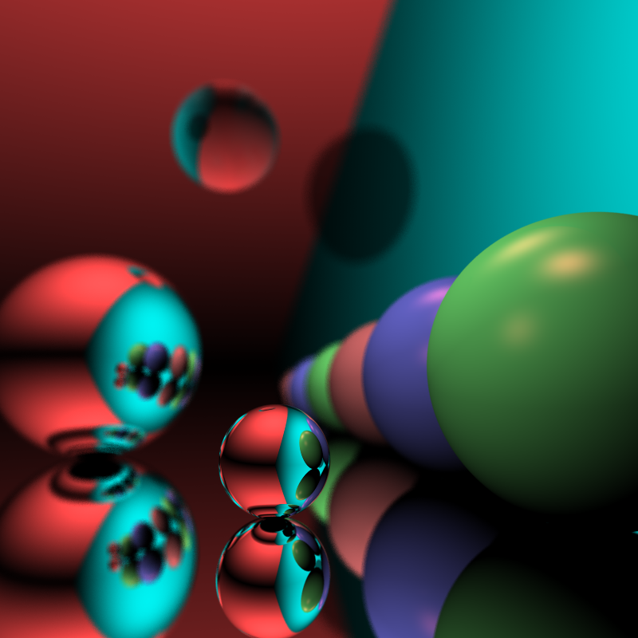
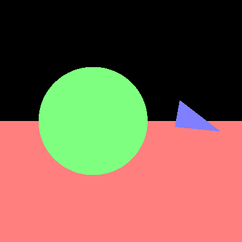
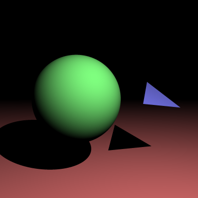
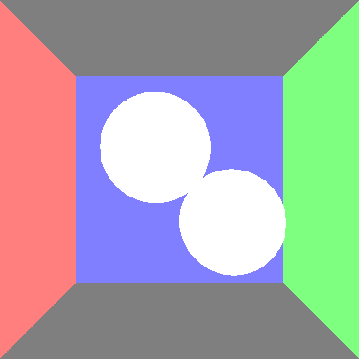
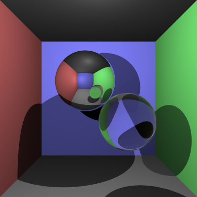

# COMP30019 - Project 1 - Ray Tracer

This is your README.md... you should write anything relevant to your
implementation here.

Please ensure your student details are specified below (*exactly* as on UniMelb
records):

**Name:** Yifan Yang
**Student Number:** 1269143
**Username:** YIFYANG5
**Email:** yifyang5@student.unimelb.edu.au

## Completed stages

Tick the stages bellow that you have completed so we know what to mark (by
editing README.md). **At most 9** marks can be chosen in total for stage
three. If you complete more than this many marks, pick your best one(s) to be
marked!

<!---
Tip: To tick, place an x between the square brackes [ ], like so: [x]
-->

##### Stage 1

- [x] Stage 1.1 - Familiarise yourself with the template
- [x] Stage 1.2 - Implement vector mathematics
- [x] Stage 1.3 - Fire a ray for each pixel
- [x] Stage 1.4 - Calculate ray-entity intersections
- [x] Stage 1.5 - Output primitives as solid colours

##### Stage 2

- [x] Stage 2.1 - Diffuse materials
- [x] Stage 2.2 - Shadow rays
- [x] Stage 2.3 - Reflective materials
- [x] Stage 2.4 - Refractive materials
- [x] Stage 2.5 - The Fresnel effect
- [x] Stage 2.6 - Anti-aliasing

##### Stage 3

- [ ] Option A - Emissive materials (+6)
- [ ] Option B - Ambient lighting/occlusion (+6)
- [ ] Option C - OBJ models (+6)
- [x] Option D - Glossy materials (+3)
- [x] Option E - Custom camera orientation (+3)
- [ ] Option F - Beer's law (+3)
- [x] Option G - Depth of field (+3)

*Please summarise your approach(es) to stage 3 here.*

Option D - Glossy Materials
I implemented the idea of glossy materials following the Phong Model, where glossy materials 
have both a diffuse component and a glossy component. I applied the formula of
Final shading colour = diffusecolor * ratioDiffuse + reflectivecolor * ratioReflective
By controlling these parameters, you can change the balance of how much 'diffuse' compared 
to how much 'reflection' the glossy material appears to be in the final output. However, when 
researching this approach, in order to create a realistic output where the reflective highlight 
is not extremely focussed, the original reflective component (V.R) is raised to a power of N.
The higher the value of N, the more 'tight' this specular (reflective) highlight will be.
Sources used have been linked in references below.

Option E - Custom Camera Orientation
I have applied the custom camera orientation through using quaternions to transform the vector 
to world space based on the camera position, axis and angle. By using the original ray direction
and the rotation vector, as well as the inverse rotation vector, both obtained through the 
camera axis rotation and angle of rotation, I have applied the Hamilton product twice to the 
quaternions to obtain the new direction vector. By scaling the original vector's original position
by the camera position adjustment, and the new direction as the calculated direction, custom camera
orientation is complete.
Sources used have been linked in references below.

Option G - Depth of Field
To apply depth of field, first I calculated focal point P, with given focal length and ray direction.
To implement the blur effect, I used random sampling to randomly fire rays which are offset in the x
and y direction by a random double between -1 and 1. Firing these rays towards the focal point, 
any area surrounding the focal plane will be more in focus, whereas objects not on this focal plane will
will appear blurred. The blur tightness can be improved with upped anti-aliasing factor.
Sources used have been linked in references below.

## Final scene render

Be sure to replace ```/images/final_scene.png``` with your final render so it
shows up here.



This render took **53** minutes and **37** seconds on my PC.

I used the following command to render the image exactly as shown:

```
dotnet run -- -f tests/final_scene.txt -o output.png -p "0,-0.1,0" -a "1,1,0" -n -5 -r 0.04 -t 1.45 -x 4 -w 800 -h 800
```

## Sample outputs

We have provided you with some sample tests located at ```/tests/*```. So you
have some point of comparison, here are the outputs our ray tracer solution
produces for given command line inputs (for the first two stages, left and right
respectively):

###### Sample 1 

```
dotnet run -- -f tests/sample_scene_1.txt -o images/sample_scene_1.png -x 4
```

<p float="left">
  
   
</p>

###### Sample 2

```
dotnet run -- -f tests/sample_scene_2.txt -o images/sample_scene_2.png -x 4
```

<p float="left">
  
   
</p>

## References

*You must list any references you used - add them here!*
Intersections

https://www.scratchapixel.com/lessons/3d-basic-rendering/minimal-ray-tracer-rendering-simple-shapes/ray-sphere-intersection
https://www.scratchapixel.com/lessons/3d-basic-rendering/minimal-ray-tracer-rendering-simple-shapes/minimal-ray-tracer-rendering-spheres

Shadows & Diffusion

https://www.scratchapixel.com/lessons/3d-basic-rendering/introduction-to-shading/ligth-and-shadows
https://www.scratchapixel.com/lessons/3d-basic-rendering/introduction-to-shading/diffuse-lambertian-shading
https://www.scratchapixel.com/lessons/3d-basic-rendering/introduction-to-shading/shading-multiple-lights

Reflection and Refraction

https://www.scratchapixel.com/lessons/3d-basic-rendering/introduction-to-shading/reflection-refraction-fresnel
https://blog.demofox.org/2017/01/09/raytracing-reflection-refraction-fresnel-total-internal-reflection-and-beers-law/
https://www.researchgate.net/figure/Principle-of-the-Fresnel-effect-the-amount-of-reflection-on-a-reflective-surface-depends_fig3_319178578
https://stackoverflow.com/questions/29758545/how-to-find-refraction-vector-from-incoming-vector-and-surface-normal#:~:text=Let%20n%20be%20the%20normalized,%2D%20sqrt(1%2DMath.

Random double between range

https://code-maze.com/csharp-random-double-range/

Glossy Materials (Phong illumation model)

https://www.scratchapixel.com/lessons/3d-basic-rendering/phong-shader-BRDF/phong-illumination-models-brdf
https://stackoverflow.com/questions/37798976/java-ray-tracing-glossy-reflection-coloring
https://stackoverflow.com/questions/32077952/ray-tracing-glossy-reflection-sampling-ray-direction

Depth of Field

https://pathtracing.home.blog/depth-of-field/
https://medium.com/@elope139/depth-of-field-in-path-tracing-e61180417027
https://computergraphics.stackexchange.com/questions/66/how-is-depth-of-field-implemented

Custom Camera

https://math.stackexchange.com/questions/40164/how-do-you-rotate-a-vector-by-a-unit-quaternion
https://en.wikipedia.org/wiki/Quaternion#Hamilton_product


